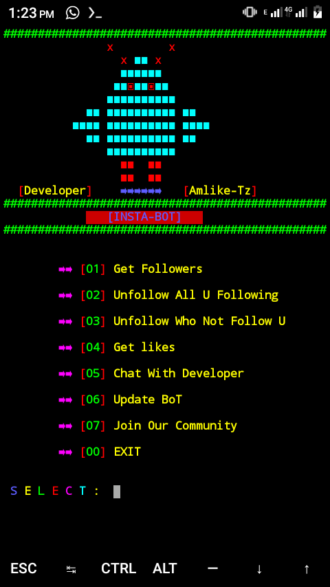

# INSTA-BOT
This Is INSTAGRAM Follow Unfollow Bot Which Can increase Up to 250 Followers A Day.


#INSTA-BOT

INSTA-BOT is a tool designed to HELP you to increase Your Instagram Account followers Without violate INSTAGRAM rules.

## Installation

Use The following steps to install INSTA-BOT in Your Termux.

```bash
pkg update && pkg upgrade
```

```bash.
git clone https://GitHub.com/Amlike-Tz/INSTA-BOT.git
```

```bash
ls
```

```bash
cd INSTA-BOT
```

```bash
ls
```


```bash
chmod +x install-requirement.sh
```


```bash
bash install-requirement.sh
```

```bash
python start.py
```
'IN KALI LINUX JUST USE

```bash
python3 start.py
```

##INSTA-BOT



## FEATURES

```Easy To use

By clicking few steps

# Get up to 250 Followers a day'

# Both Local and Internatinal Follwers'


# No Bugs  'simplified'

```

## Join OUR chanel 

https://t.me/TeamAmlikeTz
